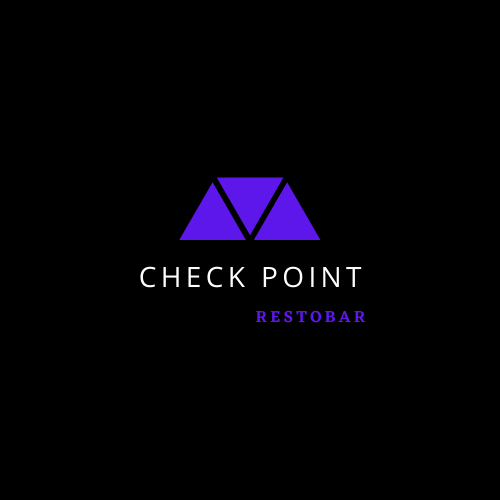

# Check Point Resto Bar

## Breve descripción
Check Point es una plataforma de venta de comida y cervecería artesanal que nace frente a la necesidad de innovación del rubo gastronomico al encontrarse afectado por la pandemia de COVID-19.

Buscamos atraer un público que disfrute de platos típicos de bar como así también de cervezas artesanales.

## Acerca de nosotros
Somos un grupo de apasionados de la programación web que durante la cuarentena sintió que a las reuniones por Zoom con amigos les faltaba algo: una buena picada y una cerveza artesanal bien fría.

#### [Ana Patricia Rojas](https://github.com/AnytaPato)
- 39 años
- Emprendedora
- La hamburguesería y la cerveza artesanal son su debilidad

#### [Josue Abi Rached](https://github.com/JSabirached)
- 24 años
- Estudiante universitario 
- Amante de la pizza

#### [Matías Cardillo](https://github.com/matss91)
- 29 años
- Vendedor
- Le encantan las hamburguesas

## Sitios de referencia
- [PedidosYa](https://www.pedidosya.com.ar)
- [Punto Limite Bar](https://www.puntolimitebar.com)
- [El Club de la Milanesa](https://www.elclubdelamilanesa.com)
- [La Birra Bar](https://www.labirrabar.com)
- [Rock & Feller's](https://www.rockandfellers.com.ar)
- [Mercado Libre](https://www.mercadolibre.com.ar)

Principalmente, nuestra elección se baso en la estetica y la experiencia de usuario. Aunque también elegimos sitios por su funcionalidad, tal es el caso de Mercado Libre y PedidosYa

## Wireframes
- [Home](https://github.com/JSabirached/Grupo_1_CheckPoint/blob/master/wireframes/wireframe-home/wireframe-home.png)
- [Detalle de producto](https://github.com/JSabirached/Grupo_1_CheckPoint/blob/master/wireframes/wireframe-detalles/resto-destopk.png)
- [Carrito de compras](https://github.com/JSabirached/Grupo_1_CheckPoint/blob/master/wireframes/carrito-de-compras/carrito-de-compras-desktop.png)
- [Formulario de registro](https://github.com/JSabirached/Grupo_1_CheckPoint/blob/master/wireframes/wireframe-registro/desktop.png)
- [Formulario de carga de producto](https://github.com/JSabirached/Grupo_1_CheckPoint/blob/master/wireframes/wireframe-admin/agregarplatoescritorio.png)

## Elementos del diseño
- [Logo](https://github.com/JSabirached/Grupo_1_CheckPoint/blob/master/design/logo.png)
- [Paleta de colores](https://colorhunt.co/palette/253094)
- [Tipografía](https://fonts.google.com/specimen/Architects+Daughter?selection.family=Lato|Montserrat|Open+Sans|Raleway&sidebar=&query=in&preview.text=%20check%20point%20%20todas%20%20%20%20%20pasta%20fresca&preview.text_type=custom&sidebar.open=true)

## Link de referencia de la organizacion del equipo
- [Trello](https://trello.com/b/KcVtDfjU/grupo-1-check-point)

## Link de nuestras RETROSPECTIVAS
- [Retrospectiva](https://app.mural.co/t/grupo13779)